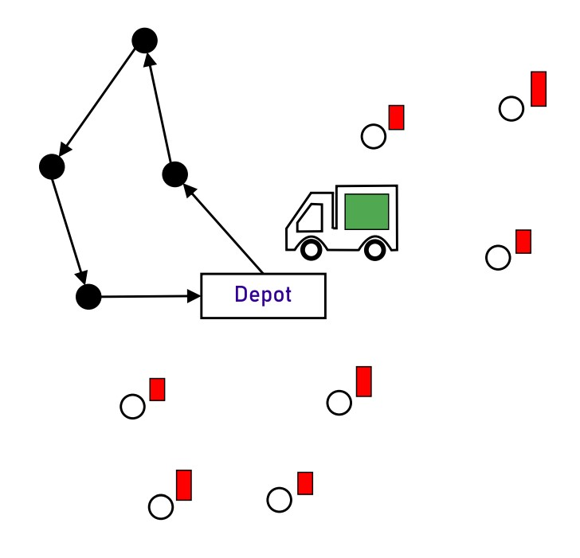
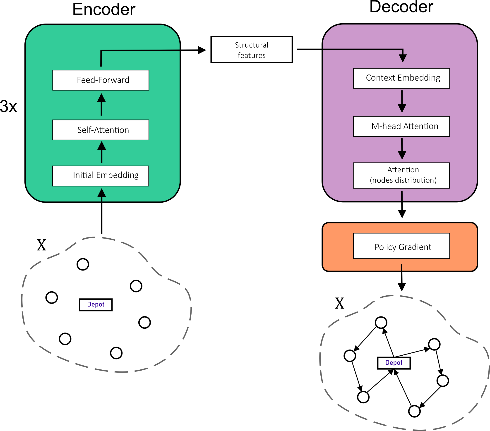
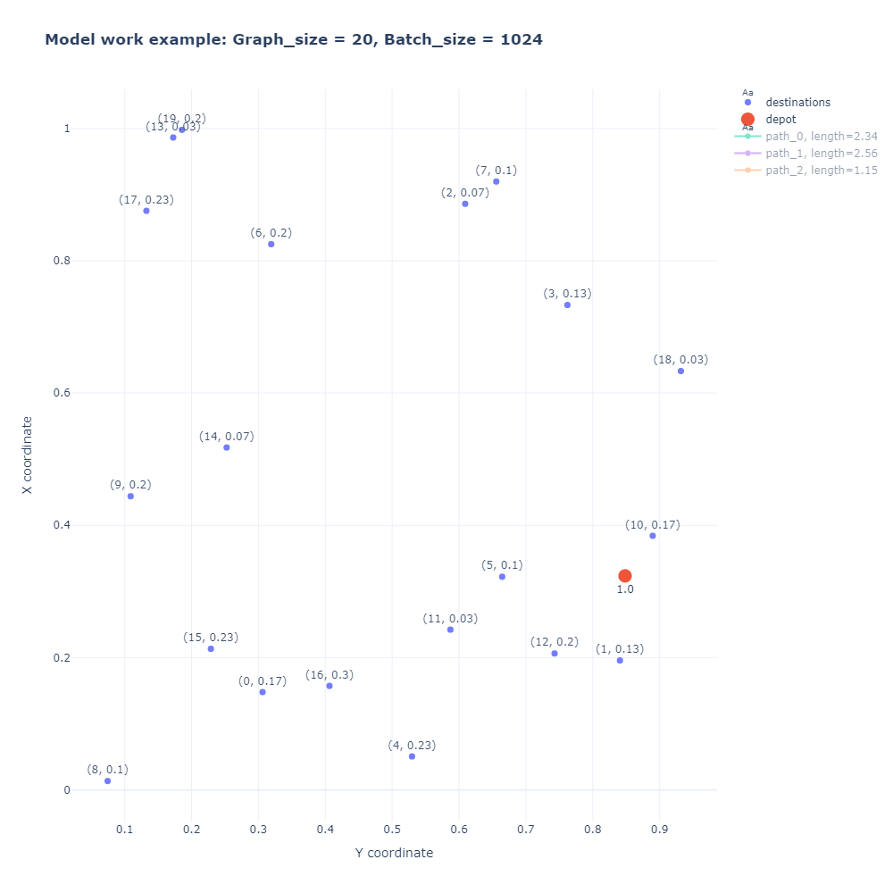

# Dynamic Attention Model for Vehicle Routing Problems
### Dmitry Eremeev, Alexey Pustynnikov

### This repository contains implementation of <a href="https://arxiv.org/abs/2002.03282">A Deep Reinforcement Learning Algorithm Using Dynamic Attention Model for Vehicle Routing Problems</a> article (TensorFlow2). 

This work was done as a final project for <a href="http://deeppavlov.ai">DeepPavlov </a> course: <a href="http://deeppavlov.ai/rl_course_2020">Advanced Topics in Deep Reinforcement learning </a>. A non-dynamic version (<a href="https://arxiv.org/abs/1803.08475">Attention, Learn to Solve Routing Problems!</a> ) of this algorithm, which was implemented as a part of this project, can be found at <xxx>.

One of the most important applications of combinatorial optimization is vehicle routing problem, in
which the goal is to find the best routes for a fleet of vehicles visiting a set of
locations. Usually, "best" means routes with the least total distance or cost.

We would consider only particular case of general VRP problem: Capacitated
Vehicle Routing Problem (CVRP), where the vehicle has a limited carrying
capacity of the goods that must be delivered.

VRP is an NP-hard problem (Lenstra and Rinnooy Kan, 1981). 

Exact algorithms are only efficient for small problem instances.
The number of near-optimal algorithms are introduced in academic
literature. There are multiple professional tools for solving various VRP
problems (ex.  <a href="https://developers.google.com/optimization">Google OR-Tools </a>).

### Attention Model Aproach

The structural features of the input graph instance are extracted by the encoder.
Then the solution is constructed incrementally by the decoder. 

Specifically, at each construction step, the decoder predicts a distribution over nodes, then one
node is selected and appended to the end of the partial solution. 

#### Main ideas:

- Use RL to create agent that can learn heuristics and provide suboptimal solutions.
- Make use of Graph Attention Networks (GAT) to create appropriate graph embeddings for the agent.
- Policy of RL agent is governed by decoder.

#### Architecture:

#### Dynamic Attention Model (AM-D) Approach:

- After vehicle returns to depot, the remaining nodes could be considered as a new (smaller) instance (graph) to be solved.
- <b>Idea: update embedding of the remaining nodes using encoder after agent arrives back to depot. </b>

- Implementation:

 1) Force RL agent to wait for others once it arrives to $x_0$.
 
 2) When every agent is in depot, apply encoder with mask to the whole batch.
 

#### Enviroment:

Current enviroment implementation is located in **enviroment.py** file -  AgentVRP class .

The class contains information about current state and actions that were done by agent.

Main methods:

- **step(action)**: transit to a new state according to the action.
- **get_costs(dataset, pi)**: returns costs for each graph in batch according to the paths in action-state space.
- **get_mask()**: returns a mask with available actions (allowed nodes).
- **all_finished()**: checks if all games in batch are finished (all graphes are solved).
- **partial_finished()**: checks if partial solutions for all graphs has been built, i.e. all agents came back to depot.

Let's connect current terms with RL language (small dictionary):

- **State**: $X$ - graph instance (coordinates, demands, etc.) together with information in which node agent is located.
- **Action**: $\pi_t$ - decision in which node agent should go.
- **Reward**: The (negative) tour length.

#### Model Training:

AM-D is trained by policy gradient using <a href="https://link.springer.com/article/10.1007/BF00992696">REINFORCE </a> algorithm with baseline.

**Baseline**

- Baseline is a <b>copy of model</b> with fixed weights from one of the preceding epochs.
- Use warm-up for early epochs: mix exponential moving average of model cost over past epochs with baseline model.
- Update baseline at the end of epoch if the difference in costs for candidate model and baseline is statistically-significant (t-test).
- Baseline uses separate dataset for this validation. This dataset is updated after each baseline renewal.

**Example**

# Files Description:

Implementation in **TensorFlow 2**

 0) **AM-D for VRP Report.ipynb** - demo report notebook
 1) **enviroment.py** - enviroment for VRP RL Agent
 2) **attention_graph_encoder.py** - Graph Attention Encoder
 3) **layers.py** - MHA layers for encoder
 4) **reinforce_baseline.py** - class for REINFORCE baseline
 5) **attention_dynamic_model.py** - main model and decoder
 6) **train.py** - defines training loop, that we use in train_model.ipynb
 7) **train_model.ipynb** - from this file one can start training or continue training from chechpoint
 8) **utils.py** and **utils_demo.py** - various auxiliary functions for data creation, saving and visualisation
 9) **lkh3_baseline** folder - everything for running LKH algorithm + logs.
 10) results folder: folder name is ADM_VRP_{graph_size}_{batch_size}. There are training logs, learning curves and saved models in each folder 
 
 # Training procedure:
  1) Open  **train_model.ipynb** and choose training parameters.
  2) All outputs would be saved in current directory.
